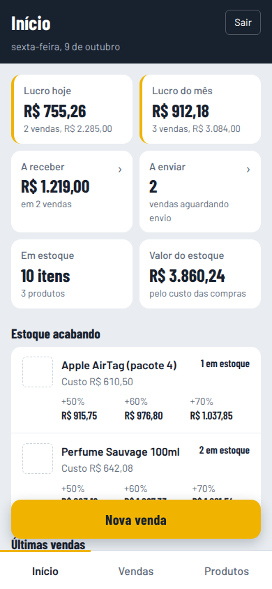
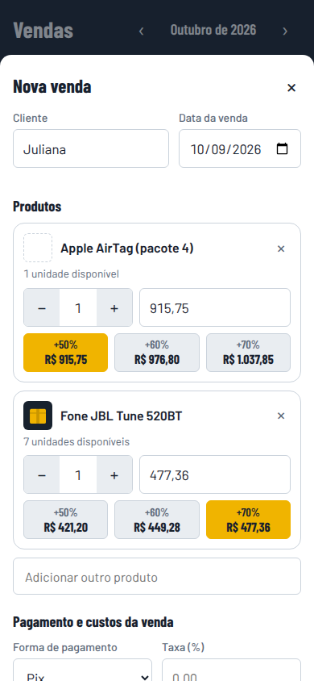
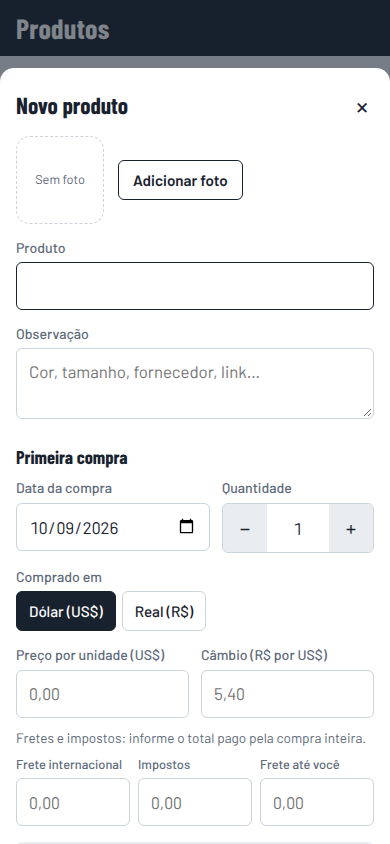
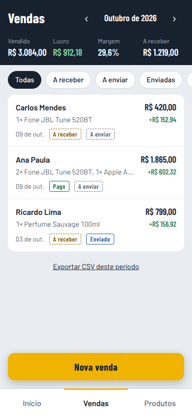

# Controle de Vendas de Importação

App web mobile first para quem revende produtos importados: registra as compras com o custo real (produto, câmbio, fretes e impostos), sugere preço de venda, controla o estoque e mostra quanto você lucrou, quanto tem a receber e o que falta enviar.

<p>
  
  
  
  
</p>

## O que faz

**Início:** lucro de hoje e do mês, quanto falta receber, quantas vendas faltam enviar, itens e valor em estoque, produtos acabando e últimas vendas.

**Produtos:** nome, foto, observação e o histórico de compras. Em cada compra você informa quantidade, preço em US$ ou R$, câmbio, frete internacional, impostos e frete até você. O app calcula o custo por unidade, mostra quanto pesa cada parte e sugere preços com +50%, +60% e +70%.

**Vendas:** uma venda pode ter vários produtos. Você busca o produto, toca num preço sugerido ou digita o valor final. A taxa da forma de pagamento, o frete que você paga e o desconto entram na conta do lucro, que aparece antes de salvar. Pagamento (a receber, pago) e entrega (a enviar, enviado, entregue) são acompanhados separadamente. No celular a lista vira cartões; no computador, uma planilha. Exporta CSV para o Excel.

**Também:** login com senha, paginação, busca sem acento e instalação na tela inicial do celular (PWA).

## Começo rápido

### Com Docker (recomendado para usar de verdade)

```bash
cp .env.example .env        # preencha ADMIN_USER e ADMIN_PASSWORD
docker compose up -d --build
```

Abra http://127.0.0.1:8000 e entre com o usuário do `.env`. Para publicar na internet com HTTPS, siga [docs/deploy.md](docs/deploy.md).

### Sem Docker (desenvolvimento)

```bash
python3 -m venv .venv
.venv/bin/pip install -r requirements-dev.txt
.venv/bin/python -m app.usuarios seu-usuario     # cria o usuário (pede a senha)
.venv/bin/uvicorn app.main:app --reload --port 8000
```

## Documentação

| Documento | Conteúdo |
|---|---|
| [Guia de uso](docs/uso.md) | Como cadastrar produtos, registrar compras e vendas, filtros, CSV, instalar no celular |
| [Regras de negócio](docs/regras-de-negocio.md) | Todas as contas (custo, estoque, preço sugerido, taxa, lucro, CSV) com exemplos |
| [Deploy](docs/deploy.md) | Docker, Compose, proxy reverso e HTTPS, usuários, backup, atualização |
| [API](docs/api.md) | Rotas HTTP, formatos e códigos de erro |
| [Desenvolvimento](docs/desenvolvimento.md) | Estrutura do código, banco, testes e convenções |
| [Segurança](docs/seguranca.md) | Login, sessões, limites, cabeçalhos e cuidados de operação |

## Tecnologia

Python 3.13, FastAPI e SQLite no servidor; HTML, CSS e JavaScript puros no navegador, sem etapa de build. Valores em dinheiro são sempre centavos inteiros, para não haver erro de arredondamento.

## Licença

Uso privado. Defina uma licença antes de distribuir.
